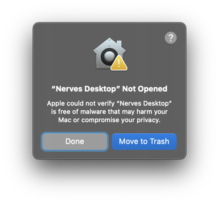
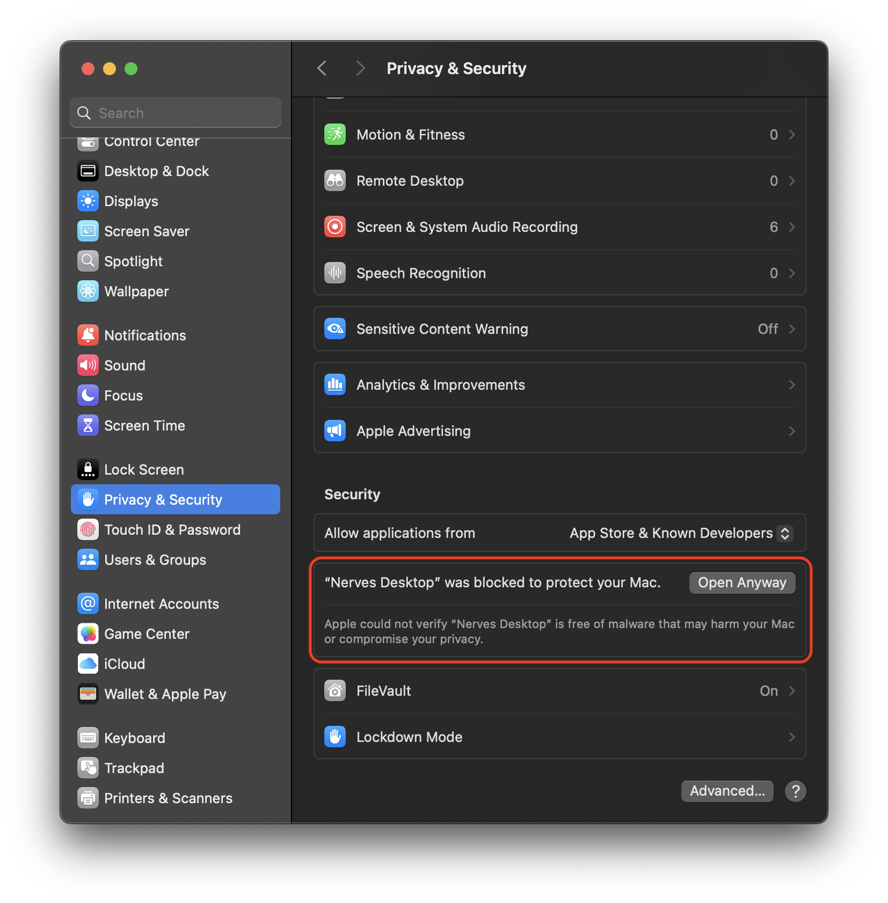
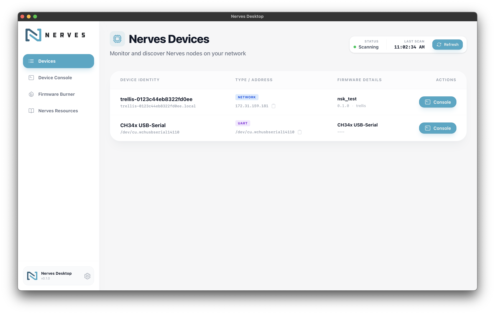
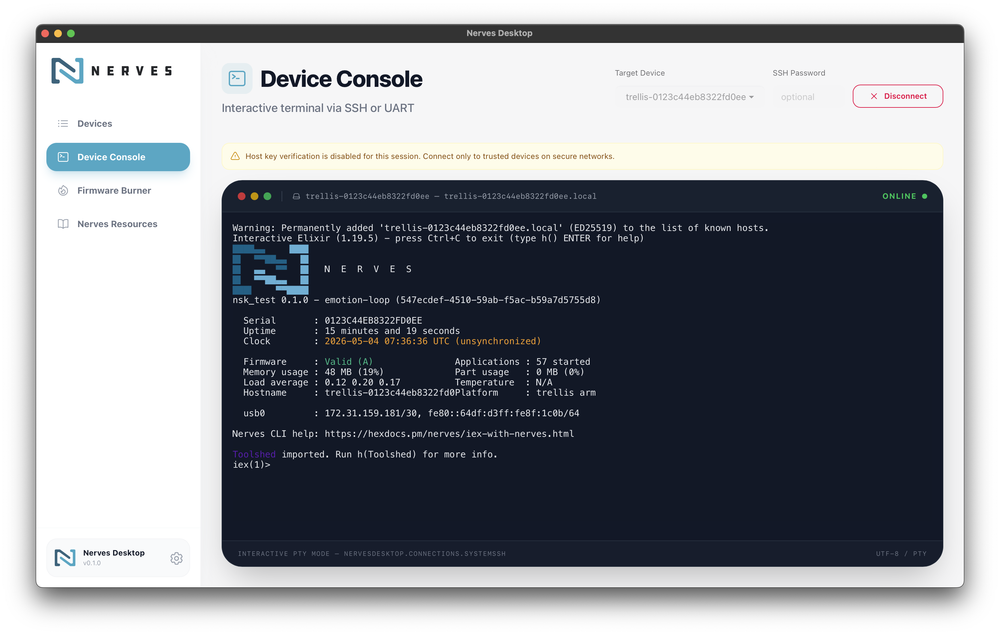
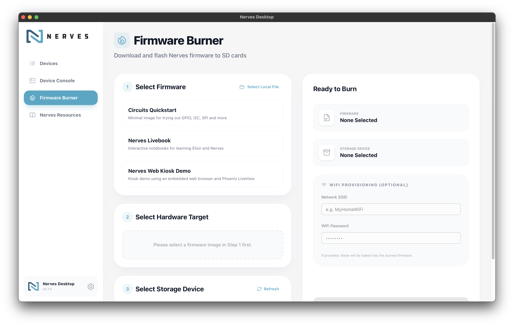

# Nerves Desktop

A native desktop application for discovering, managing, and provisioning Nerves
devices. Built with Phoenix LiveView and
[ElixirKit](https://github.com/livebook-dev/elixirkit).

## Installation

This application is in the very early stages of development. Nightly builds can
be found
[here](https://github.com/nerves-project/nerves_desktop/releases/tag/nightly).
Download and install the correct target for your platform. We currently build
for the following targets/architectures:

- MacOS (Intel and Apple Silicon)
- Windows (x64)
- Linux (amd64 and aarch64)
  - .deb (Ubuntu/Debian)
  - .rpm (Fedora)
  - AppImage (everything else)

If you download and install the software, please note the following:

- Code signing is not set up yet. You may receive errors or warnings that the
  software is untrusted. For MacOS, the error looks like the following:
  

  To override this, go to Privacy & Security setting and press "Open Anyway":

  

- There may be bugs with installation or use of the software. If you run into
  any, please file issues

## Features

- **Device Discovery**: Automatically find Nerves devices on your local network
  via mDNS.
- **Interactive Console**: Built-in iex console over UART or SSH powered by
  `xterm.js` for direct device interaction.
- **Firmware Burner**: Download and flash Nerves firmware images to SD
  cards/storage devices.
- **Resources**: A page of quick links to a wide range of Nerves resources,
  repos, hex packages and more

## Screenshots





## Prerequisites

To run this application from source, you need the following installed on your
host machine:

### 1. Development Environment

- Elixir 1.19 and Erlang/OTP 28
- Rust** and Cargo (via [rustup](https://rustup.rs/))
- Node.js** (for assets)
- Tauri CLI*— `cargo tauri` is not part of stock Cargo. Install it with:

  ```bash
  cargo install tauri-cli --version "^2.0" --locked
  ```

### 2. System Dependencies

**macOS**:

```bash
brew install libusb dtc zlib pkg-config
```

**Ubuntu/Debian** (includes Tauri's WebKit/GTK requirements as well as the
`sunxi` tooling deps):

```bash
sudo apt-get install \
  libwebkit2gtk-4.1-dev libsoup-3.0-dev libjavascriptcoregtk-4.1-dev \
  libusb-1.0-0-dev libfdt-dev zlib1g-dev pkg-config
```

## Getting Started

### 1. Setup Elixir Dependencies

```bash
mix deps.get
```

### 2. Setup Frontend Assets

```bash
npm install --prefix assets
```

### 3. Run the Desktop App

The following command starts the Phoenix server and the native Tauri window
simultaneously:

```bash
cargo tauri dev
```

## Future Work

Currently, this is an experiment to see if this is a useful resource for the
Nerves community. Your feedback is incredibly important to gauge that metric. We
have planned the following features for future developments (in no particular
order):

- Code signing
- Automatic updates
- Integrated Nerves MCP server (tools for connecting to Nerves devices, reading
  logs, etc)
- NervesKey provisioning
- Nerves Starter Kit integration
- Flashing second-stage bootloader (rpiboot/sunxi-fel)

If you have any feature requests, please open an issue to open discussion on the
topic

## Related Projects

This project is a thin GUI wrapper over several other Nerves projects. Notably:

- [Nerves Discovery](https://github.com/nerves-networking/nerves_discovery)
- [Nerves Burner](https://github.com/nerves-project/nerves_burner)
- [Fwup](https://github.com/fwup-home/fwup)
